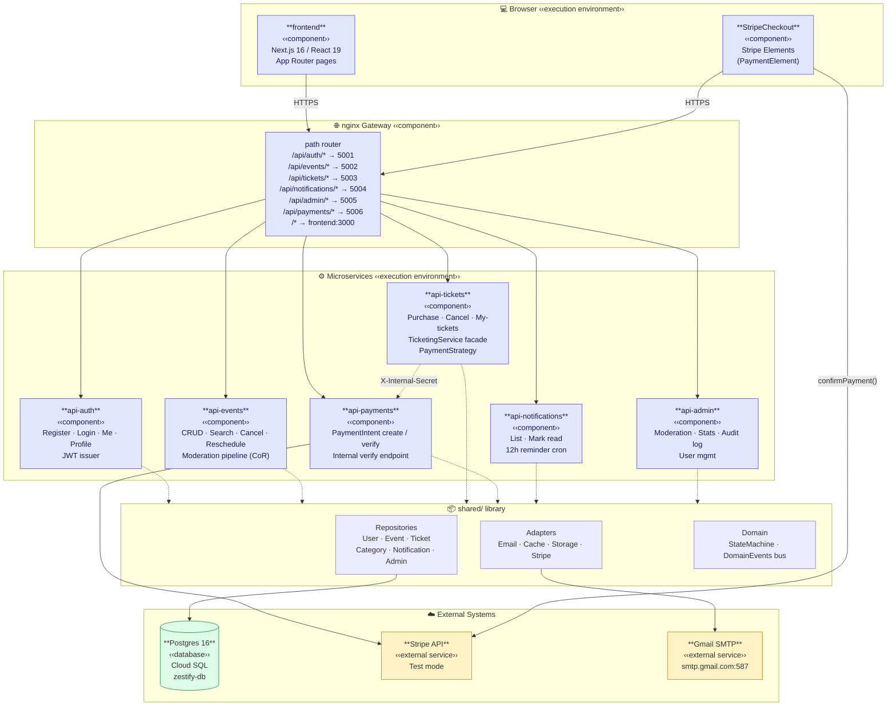
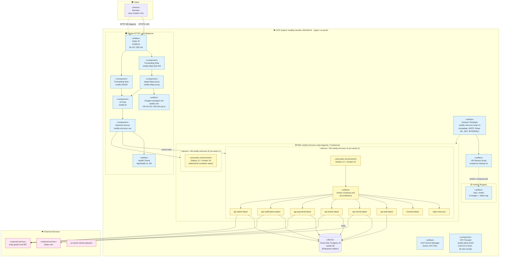
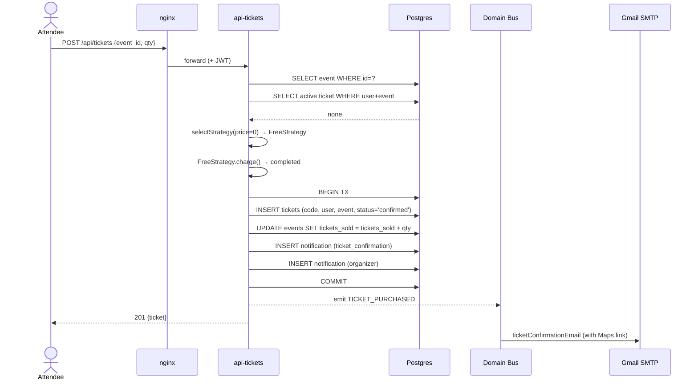
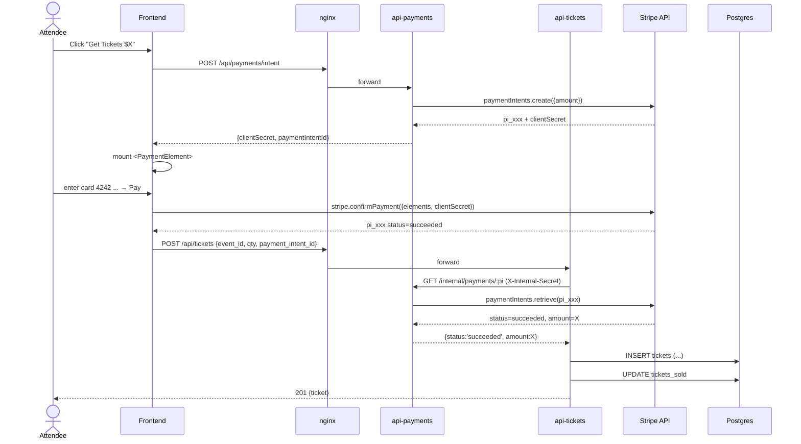
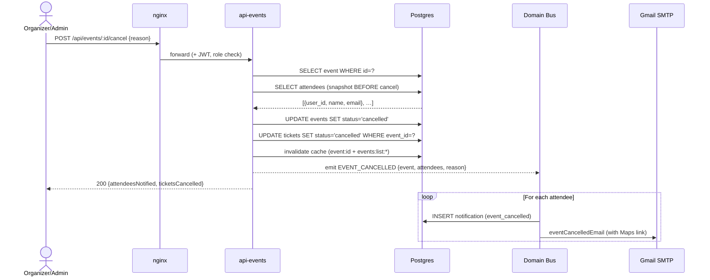
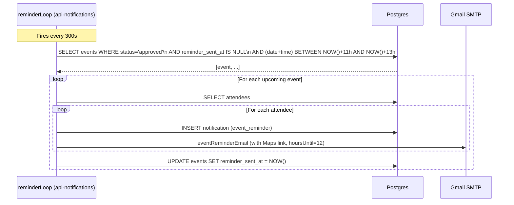
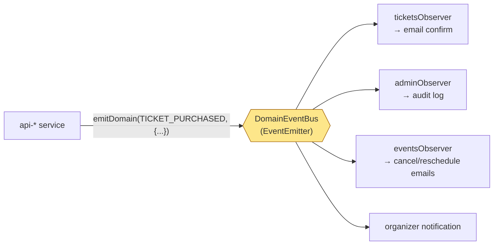
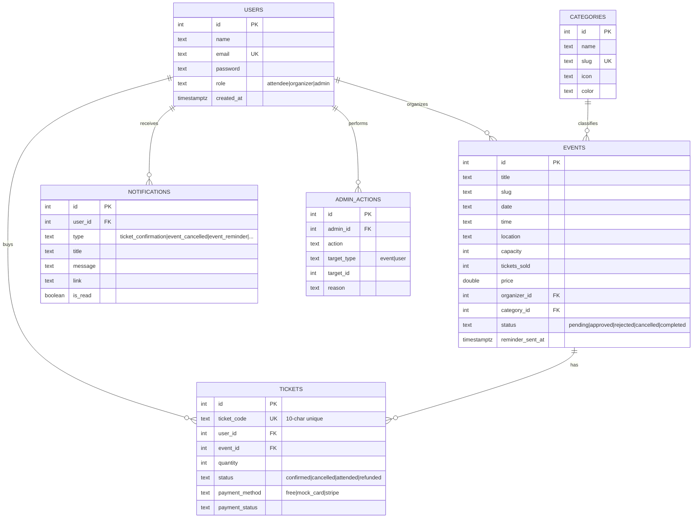
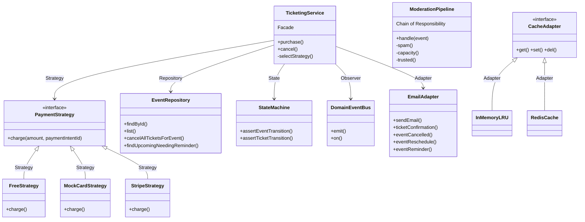

# Zestify — Architecture & Diagrams

UML-style component and deployment diagrams plus sequence diagrams for the key
cross-service flows. All diagrams are written in **Mermaid** so GitHub renders
them natively when you open this file in the browser.

---

## 1. Component Diagram (UML)

Shows the logical components of the system, their responsibilities, and the
dependencies between them. Each box is a deployable Node.js process or a static
web bundle.

### Component responsibilities

| Component | Owner | Responsibility |
|-----------|-------|----------------|
| **frontend** | Nihar + Soham | Next.js 16 App Router — all user-facing pages |
| **StripeCheckout** | Nihar | Stripe Elements widget on event detail page |
| **nginx** | Kalhar | In-VM path router, lazy DNS resolution to upstreams |
| **api-auth** | Soham | Register / login / me / profile · JWT issuance |
| **api-events** | Nihar | Event CRUD + search + cancel + reschedule + CoR moderation |
| **api-tickets** | Soham | Ticket purchase / cancel / my-tickets · Facade over PaymentStrategy |
| **api-payments** | Nihar | Stripe SDK wrapper · PaymentIntent create/retrieve · internal verify endpoint |
| **api-notifications** | Kalhar | List + mark-read · 12h-before reminder cron loop |
| **api-admin** | Kalhar | Moderation queue · stats · audit log · user management |
| **shared/** | All 3 | Cross-cutting repositories + adapters + domain (state machine + event bus) |

---

## 2. Deployment Diagram (UML)

Shows the physical deployment topology — GCP resources, VM nodes, and the
containers running on each.

### Physical resources

| Tier | Resource | Spec | Notes |
|------|----------|------|-------|
| LB | Global HTTPS LB | 2 forwarding rules (80 + 443) | Static IP `zestify-ip` |
| SSL | Managed certificate | Google Trust Services WR3 | Auto-renewed every 90 days |
| Compute | MIG (regional us-west1) | 2 × **e2-medium**, 2 vCPU / 4 GB | Auto-heal + rolling-replace |
| VM OS | Debian 12 (bookworm) | Docker 24 + docker-compose-plugin | Bootstrap via startup script |
| DB | Cloud SQL Postgres 16 | **Enterprise** edition · authorized networks | Single zone for cost |
| Registry | Artifact Registry | `zestify` repo · 8 image tags | `:latest` re-pushed every CI run |
| Network | VPC firewall | Port 80 from Google LB ranges | `130.211.0.0/22`, `35.191.0.0/16` |
| Secrets | VM metadata (server-only) | DB_HOST/PASS, JWT, STRIPE_SK, SMTP creds | ZST-041 will migrate to Secret Manager |

---

## 3. Sequence Diagrams (key flows)

### 3.1 Free ticket purchase

### 3.2 Paid ticket purchase via Stripe (cross-service)

### 3.3 Event cancellation (organizer or admin)

### 3.4 12-hour reminder cron

### 3.5 Domain event flow (Observer pattern)

---

## 4. Database ER (entity relationships)

Partial unique index `uniq_active_ticket ON tickets(user_id, event_id) WHERE status != 'cancelled'`
lets a user cancel + repurchase the same event without UNIQUE conflict (ZST-019).

---

## 5. Design Pattern Map

Patterns used:

| Pattern | Where |
|---------|-------|
| **Repository** | `shared/repositories/*Repository.js` — encapsulates Postgres access per aggregate |
| **Strategy** | `services/tickets/strategy.js` — Free / MockCard / Stripe selected at runtime |
| **Facade** | `services/tickets/service.js` — `TicketingService.purchase()` hides 5 sub-steps |
| **Observer** | `shared/domain/DomainEvents.js` — in-process bus over Node's `EventEmitter` |
| **Chain of Responsibility** | `services/events/moderation.js` — Spam → Capacity → TrustedOrganizer |
| **State** | `shared/domain/StateMachine.js` — legal-transition assertions |
| **Adapter** | `shared/adapters/{Email,Cache,Storage,Stripe}Adapter.js` — pluggable backends |
| **Template Method** | `shared/adapters/EmailAdapter.js` — common HTML skeleton, per-event subject + body |
