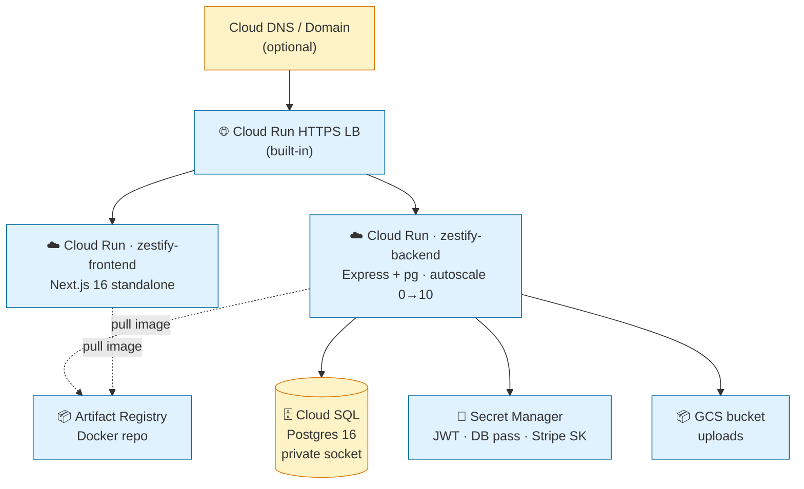

# GCP Deployment

## Architecture (Cloud Run target — Terraform path)



> Note: production deployment uses **Compute MIG + Global HTTPS LB** instead (see
> [`architecture.md`](architecture.md)). Cloud Run path stays available via
> Terraform modules for cheaper dev environments.

## Prereqs

- `gcloud` authenticated with billing enabled
- `terraform >= 1.6`
- Docker daemon running locally (or Cloud Build)
- A globally-unique GCS bucket name for uploads
- Stripe test keys in `.env`

## Bootstrap a project

```bash
PROJECT_ID="zestify-cmpe202"
gcloud projects create "$PROJECT_ID" --name="Zestify"
gcloud beta billing projects link "$PROJECT_ID" --billing-account="<billing-id>"
gcloud config set project "$PROJECT_ID"
```

## One-command deploy

```bash
export PROJECT_ID=zestify-cmpe202
export REGION=us-west1
export NEXT_PUBLIC_STRIPE_PUBLISHABLE_KEY=pk_test_xxx
export TF_VAR_jwt_secret=$(openssl rand -hex 32)
export TF_VAR_db_password=$(openssl rand -hex 32)
export TF_VAR_stripe_secret_key=sk_test_xxx
export TF_VAR_uploads_bucket_name="zestify-uploads-${PROJECT_ID}"

./scripts/deploy.sh dev
```

This builds + pushes both images to Artifact Registry, then runs `terraform apply` in `terraform/envs/dev`.

## Modules

| Module | Resource |
|---|---|
| `artifact_registry` | Docker repo |
| `cloud_sql` | Postgres 16 instance + db + user |
| `secrets` | Secret Manager — `jwt_secret` / `db_password` / `stripe_secret_key` |
| `iam` | Backend SA with `cloudsql.client` + `secretmanager.secretAccessor` + `storage.objectAdmin` |
| `storage` | GCS uploads bucket (uniform IAM) |
| `cloud_run_backend` | Backend service with Cloud SQL connector + secret env refs |
| `cloud_run_frontend` | Frontend service (public ingress) |

## Scale-out targets

- Postgres: `db-f1-micro` (dev) → `db-custom-1-3840` (prod) → read replicas
- Cloud Run: 0 → 10 instances autoscale on RPS / CPU
- Memorystore Redis (when added): hot `/events` cache + rate-limit token bucket
- Pub/Sub (when added): async fan-out for email + scheduled reminders
- Cloud Scheduler: 24h-before-event reminder cron → Pub/Sub → email worker

## Secrets

Never commit `terraform.tfvars` or `.env`. Use `TF_VAR_*` env vars or pull from a CI secret store.

## HTTPS / TLS (Google-managed cert)

Provisioned May 10 2026.

```bash
# 1. Reserve static IP at current LB address.
gcloud compute addresses create zestify-ip --global --addresses=34.107.158.154

# 2. Create Google-managed SSL cert (free, auto-renewed every 90 days).
gcloud compute ssl-certificates create zestify-cert \
  --domains=34.107.158.154.nip.io --global

# 3. HTTPS proxy + forwarding rule on port 443.
gcloud compute target-https-proxies create zestify-https-proxy \
  --url-map=zestify-lb --ssl-certificates=zestify-cert --global

gcloud compute forwarding-rules create zestify-https-fwd \
  --address=zestify-ip --global \
  --target-https-proxy=zestify-https-proxy --ports=443
```

Cert validation takes ~5-15 min (Google verifies the domain via the LB IP). After
`gcloud compute ssl-certificates describe zestify-cert --global` reports `managed.status: ACTIVE`,
the site is reachable at:

- **https://34.107.158.154.nip.io** (TLS via Google Trust Services WR3)

The HTTP forwarding rule (`zestify-fwd:80`) stays in parallel for backward compatibility.
