# Zestify — UI Wireframes

Visual wireframes for every screen in the application. Each section shows:

1. **PNG mockup** — designed in low-fidelity wireframe tool, lives in [`wireframes/`](wireframes/).
2. **ASCII layout** — quick mental model of structure, fits in a code review.
3. **Mermaid flowchart** — interactive box-and-line view that renders on GitHub.

## Screen index

| # | Screen | Image | Section |
|---|--------|-------|---------|
| 1 | Landing page | [1.png](wireframes/1.png) | [§1](#1-landing-page--) |
| 2 | Events listing | [2.png](wireframes/2.png) | [§2](#2-events-listing-events) |
| 3a | Event detail — attendee | [3a.png](wireframes/3a.png) | [§3](#3-event-detail-page--role-aware-eventsid) |
| 3b/3c | Event detail — organizer + admin | [3b3c.png](wireframes/3b3c.png) | [§3](#3-event-detail-page--role-aware-eventsid) |
| 4 | Reschedule modal | [4.png](wireframes/4.png) | [§4](#4-reschedule-modal-organizer--admin-only) |
| 5 | Ticket purchase modal | [5.png](wireframes/5.png) | [§5](#5-ticket-purchase-modal) |
| 6/7 | Login + register | [6-7.png](wireframes/6-7.png) | [§6](#6-login-page-login) |
| 8 | My Tickets | [8.png](wireframes/8.png) | [§8](#8-attendee-dashboard--my-tickets-dashboardmy-tickets) |
| 9 | My Events | [9.png](wireframes/9.png) | [§9](#9-organizer-dashboard--my-events-dashboardmy-events) |
| 10 | Attendees | [10.png](wireframes/10.png) | [§10](#10-organizer-attendees-page-dashboardattendeesid) |
| 11 | Admin dashboard | [11.png](wireframes/11.png) | [§11](#11-admin-dashboard-admin) |
| 12 | Notifications | [12.png](wireframes/12.png) | [§12](#12-notifications-page-notifications) |
| 13 | Create event | [13.png](wireframes/13.png) | [§13](#13-event-creation-page-eventscreate) |
| 14 | Email templates (5) | [14.png](wireframes/14.png) | [§14](#14-email-template-wireframes) |

---

## 1. Landing Page  `/`

> Public · no auth required. Hero + featured events + categories + features.

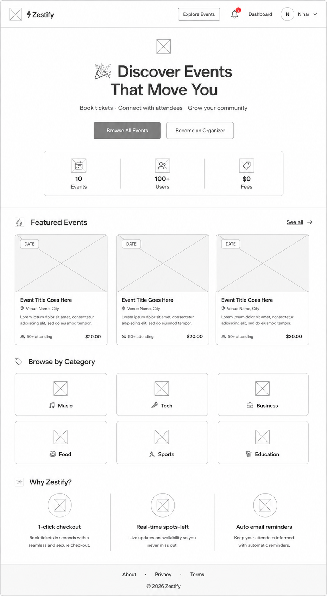

```
┌─────────────────────────────────────────────────────────────────────────┐
│  ⚡ Zestify           [Explore Events] [🔔]  [Dashboard]  (N Nihar) │ Navbar
├─────────────────────────────────────────────────────────────────────────┤
│                                                                         │
│          🎉  Discover Events That Move You                              │
│          ───────────────────────────────────                            │ Hero
│          Book tickets · Connect with attendees · Grow                   │
│                                                                         │
│          [Browse All Events]    [Become an Organizer]                   │
│                                                                         │
│          ┌─────────┬─────────┬─────────┐                                │
│          │  10     │  100+   │  $0     │                                │
│          │ Events  │ Users   │ Fees    │                                │ Stats
│          └─────────┴─────────┴─────────┘                                │
│                                                                         │
├─────────────────────────────────────────────────────────────────────────┤
│  🔥 Featured Events                                  See all →          │
│  ┌──────┬──────┬──────┐                                                 │
│  │ CARD │ CARD │ CARD │  ← EventCard tiles with emoji + price + date  │
│  └──────┴──────┴──────┘                                                 │
├─────────────────────────────────────────────────────────────────────────┤
│  🏷️ Browse by Category                                                   │
│  ┌────┬────┬────┬────┬────┬────┐                                        │
│  │🎵  │🎤  │💼  │🍔  │🏃  │📚  │                                        │
│  │Mus │Tek │Biz │Food│Sport│Art│                                        │
│  └────┴────┴────┴────┴────┴────┘                                        │
├─────────────────────────────────────────────────────────────────────────┤
│  ✨ Why Zestify?                                                        │
│  • 1-click checkout · Real-time spots-left · Auto email reminders       │
└─────────────────────────────────────────────────────────────────────────┘
│ Footer · About · Privacy · Terms · © 2026 Zestify                       │
└─────────────────────────────────────────────────────────────────────────┘
```

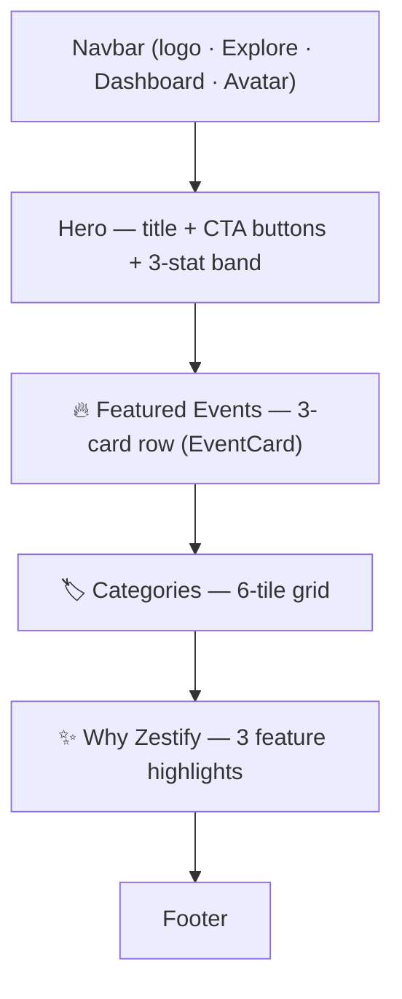
```mermaid
flowchart TB
    NAV["Navbar (logo · Explore · Dashboard · Avatar)"]
    HERO["Hero — title + CTA buttons + 3-stat band"]
    FEAT["🔥 Featured Events — 3-card row (EventCard)"]
    CAT["🏷️ Categories — 6-tile grid"]
    WHY["✨ Why Zestify — 3 feature highlights"]
    FT["Footer"]
    NAV --> HERO --> FEAT --> CAT --> WHY --> FT
```

---

## 2. Events Listing  `/events`

> Public list with search, category, city, type, sort filters + paginated grid.

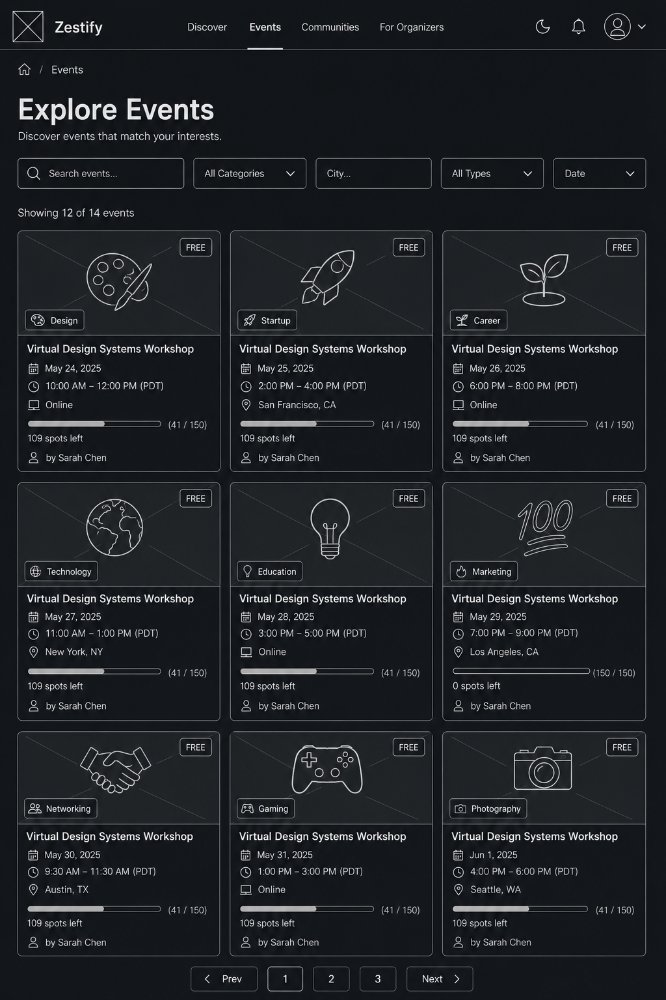

```
┌─────────────────────────────────────────────────────────────────────────┐
│  Navbar                                                                 │
├─────────────────────────────────────────────────────────────────────────┤
│  Explore Events                                                         │
│  Discover events that match your interests                              │
├─────────────────────────────────────────────────────────────────────────┤
│  ┌──────────────────────┬────────────┬────────┬────────┬────────┐       │
│  │ 🔍 Search events...  │ Category ▾ │ City…  │ Type ▾ │ Date ▾ │       │  Filters
│  └──────────────────────┴────────────┴────────┴────────┴────────┘       │
│                                                                         │
│  Showing 12 of 14 events                                                │
│                                                                         │
│  ┌────────────────┐  ┌────────────────┐  ┌────────────────┐             │
│  │ 🆓 FREE        │  │ 🆓 FREE        │  │ 🆓 FREE        │             │
│  │   💻           │  │   🧘           │  │   ⛺            │             │
│  │ Virtual Design │  │ Mindful Living │  │ Sunset Hike    │  ← Cards
│  │ Workshop       │  │ Retreat        │  │ & Photo Walk   │             │
│  │ 📅 Mar 20      │  │ 📅 Mar 28      │  │ 📅 Apr 5       │             │
│  │ 🕐 10:00 AM    │  │ 🕐 8:00 AM     │  │ 🕐 4:30 PM     │             │
│  │ 💻 Online      │  │ 📍 Napa        │  │ 📍 Sausalito   │             │
│  │ ▰▰▰▰▰▰▰▱▱▱ 109│  │ ▰▰▰▰▰▰▰▰▰▱ 11 │  │ ▰▰▰▰▰▰▰▰▰▰ 2  │             │
│  │ by Sarah Chen  │  │ by Soham Jain  │  │ by David Kim   │             │
│  └────────────────┘  └────────────────┘  └────────────────┘             │
│      (12-card grid · responsive 3-col → 1-col on mobile)                │
│                                                                         │
│           [ ← Prev ]  [1] [2] [3]  [ Next → ]                           │
└─────────────────────────────────────────────────────────────────────────┘
```

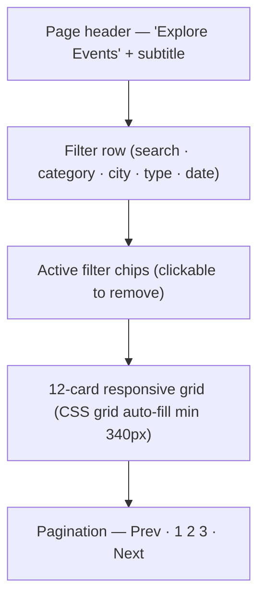
```mermaid
flowchart TB
    H["Page header — 'Explore Events' + subtitle"]
    F["Filter row (search · category · city · type · date)"]
    AF["Active filter chips (clickable to remove)"]
    G["12-card responsive grid (CSS grid auto-fill min 340px)"]
    P["Pagination — Prev · 1 2 3 · Next"]
    H --> F --> AF --> G --> P
```

---

## 3. Event Detail Page — Role-Aware  `/events/[id]`

The same page renders **three different action panels** depending on the
logged-in user's role and relationship to the event.

### 3a. Attendee view

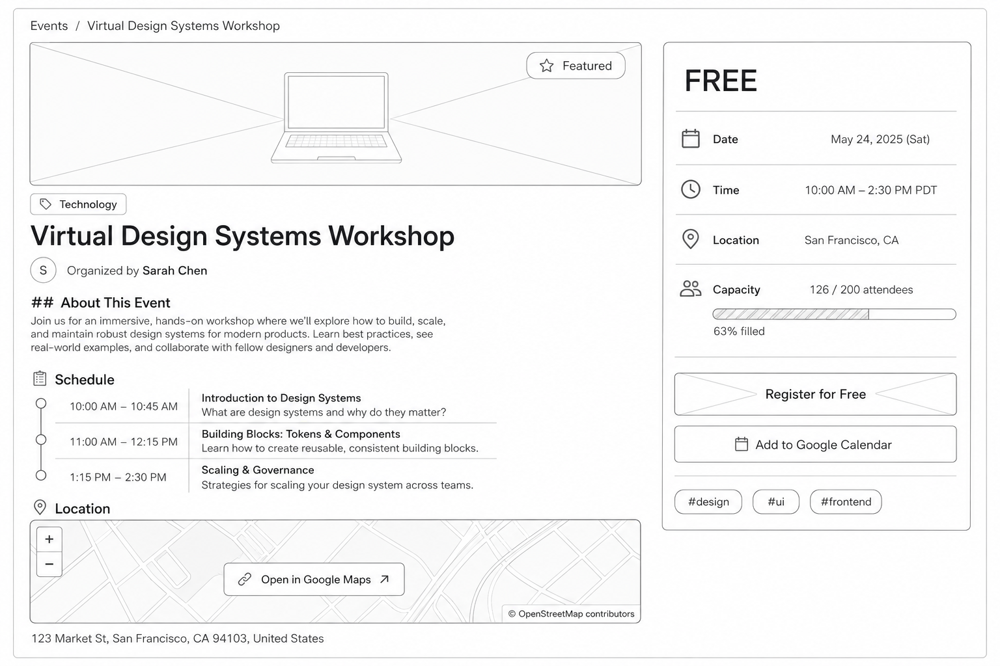

```
┌─────────────────────────────────────────────────────────────────────────┐
│  Events / Virtual Design Systems Workshop                  (breadcrumb) │
├──────────────────────────────────────────┬──────────────────────────────┤
│                                          │                              │
│  ┌────────────────────────────────────┐  │  ┌────────────────────────┐  │
│  │            💻 BANNER               │  │  │      🆓 FREE           │  │
│  │   (category-tinted gradient)       │  │  └────────────────────────┘  │
│  └────────────────────────────────────┘  │  📅 Date · Fri Mar 20, 2026  │
│                                          │  🕐 Time · 10:00 AM           │
│  🏷️ Technology                          │  💻 Location · Online Event   │
│  # Virtual Design Systems Workshop      │  👥 Capacity                   │
│                                          │     109 spots left (41/150)   │
│  (S) Organized by Sarah Chen             │     ▰▰▰▰▰▱▱▱▱▱                │
│                                          │                              │
│  ## About This Event                     │  ┌───────────────────────┐   │
│  Build a scalable design system…         │  │ Register for Free   ✓ │   │ ← attendee CTA
│                                          │  └───────────────────────┘   │
│  📋 Schedule                              │                              │
│  • 10:00 — Intro                         │  ┌───────────────────────┐   │
│  • 10:30 — Hands-on                      │  │ 📅 Add to Calendar    │   │
│  • 12:00 — Lunch                         │  └───────────────────────┘   │
│                                          │                              │
│  (no map for online event)               │  #design #ui                 │
│                                          │                              │
└──────────────────────────────────────────┴──────────────────────────────┘
```

### 3b. Organizer view (own event) · 3c. Admin view

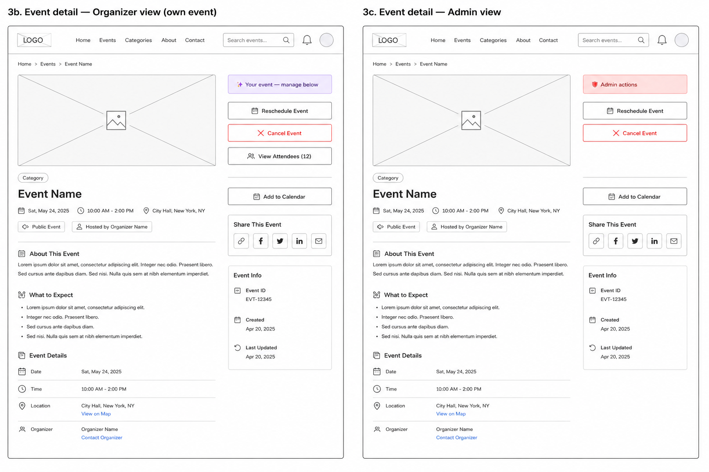

```
   ┌──────────────────────────────────────────┐
   │  ✨ Your event — manage below            │
   ├──────────────────────────────────────────┤
   │  [ 📅 Reschedule Event           ]       │ ← sidebar replaces "Register"
   │  [ ❌ Cancel Event               ]       │
   │  [ 👥 View Attendees (12)        ]       │
   └──────────────────────────────────────────┘
```

### 3c. Admin view

```
   ┌──────────────────────────────────────────┐
   │  🛡️ Admin actions                        │
   ├──────────────────────────────────────────┤
   │  [ 📅 Reschedule Event           ]       │ ← admin can act on any event
   │  [ ❌ Cancel Event               ]       │
   └──────────────────────────────────────────┘
```

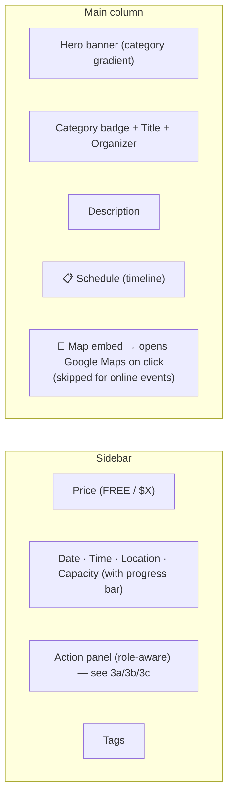
```mermaid
flowchart TB
    subgraph Main[Main column]
        B["Hero banner (category gradient)"]
        T["Category badge + Title + Organizer"]
        D["Description"]
        S["📋 Schedule (timeline)"]
        M["📍 Map embed → opens Google Maps on click<br/>(skipped for online events)"]
    end
    subgraph Side[Sidebar]
        P["Price (FREE / $X)"]
        I["Date · Time · Location · Capacity (with progress bar)"]
        A["Action panel (role-aware) — see 3a/3b/3c"]
        G["Tags"]
    end
    Main --- Side
```

---

## 4. Reschedule Modal (organizer / admin only)

> Opens from the Reschedule button. Submits to `POST /api/events/:id/reschedule`.

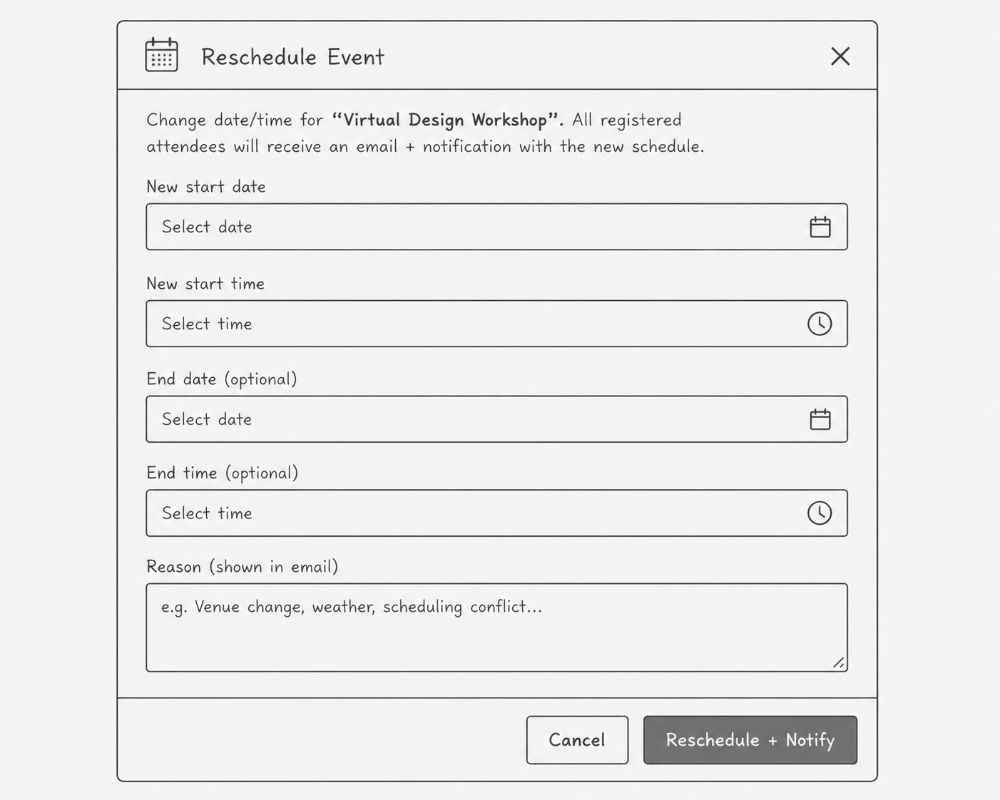

```
       ┌─────────────────────────────────────────────────────────┐
       │  📅 Reschedule Event                              ✕     │
       ├─────────────────────────────────────────────────────────┤
       │  Change date/time for **Virtual Design Workshop**.      │
       │  All registered attendees will receive an email +       │
       │  notification with the new schedule.                    │
       │                                                         │
       │  New start date  [ 2027-09-25  ▾ ]                      │
       │  New start time  [ 18:30  ▾ ]                           │
       │  End date (opt)  [           ]                          │
       │  End time (opt)  [           ]                          │
       │                                                         │
       │  Reason (shown in email)                                │
       │  ┌────────────────────────────────────────────────┐     │
       │  │ Venue change due to weather…                   │     │
       │  └────────────────────────────────────────────────┘     │
       │                                                         │
       │              [ Cancel ]    [ Reschedule + Notify ]      │
       └─────────────────────────────────────────────────────────┘
```

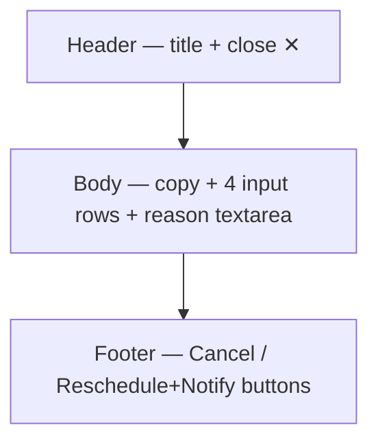
```mermaid
flowchart TB
    H["Header — title + close ✕"]
    BODY["Body — copy + 4 input rows + reason textarea"]
    F["Footer — Cancel / Reschedule+Notify buttons"]
    H --> BODY --> F
```

---

## 5. Ticket Purchase Modal

> Free events submit instantly. Paid events embed Stripe Elements.

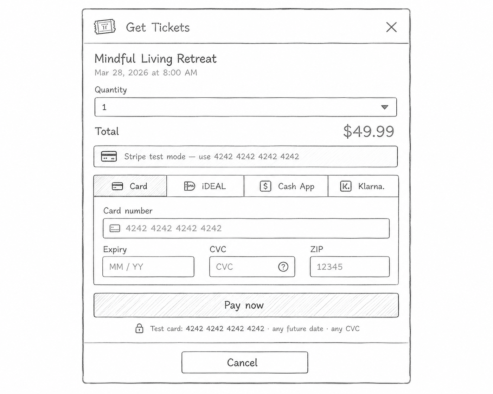

```
       ┌─────────────────────────────────────────────────────────┐
       │  🎫 Get Tickets                                    ✕    │
       ├─────────────────────────────────────────────────────────┤
       │  ## Mindful Living Retreat                              │
       │  Mar 28, 2026 at 8:00 AM                                │
       │                                                         │
       │  Quantity     [ 1 ticket ▾ ]                            │
       │                                                         │
       │  Total                                  ── $49.99       │
       │                                                         │
       │  💳 Stripe test mode — use 4242 4242 4242 4242          │
       │                                                         │
       │  ┌──── PaymentElement (Stripe Elements) ────────────┐   │
       │  │ Card · iDEAL · Cash App · Klarna  (tabs)        │   │
       │  │ ┌─────────────────────────────────────────────┐ │   │
       │  │ │ Card number  [ 1234 1234 1234 1234     ]   │ │   │
       │  │ │ Expiry [MM/YY]    CVC [   ]    ZIP [    ]   │ │   │
       │  │ └─────────────────────────────────────────────┘ │   │
       │  └─────────────────────────────────────────────────┘   │
       │                                                         │
       │  ┌───────────────────────────────────────────────────┐  │
       │  │            Pay now   ($49.99)                     │  │
       │  └───────────────────────────────────────────────────┘  │
       │  🔒 Disabled until PaymentElement reports onReady       │
       └─────────────────────────────────────────────────────────┘
```

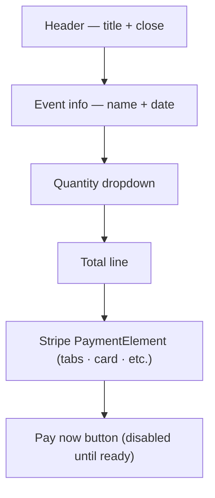
```mermaid
flowchart TB
    H["Header — title + close"]
    EI["Event info — name + date"]
    Q["Quantity dropdown"]
    TT["Total line"]
    SE["Stripe PaymentElement (tabs · card · etc.)"]
    BTN["Pay now button (disabled until ready)"]
    H --> EI --> Q --> TT --> SE --> BTN
```

---

## 6. Login Page  `/login`

> Auth form + 3 demo quick-login buttons that pre-fill team credentials.

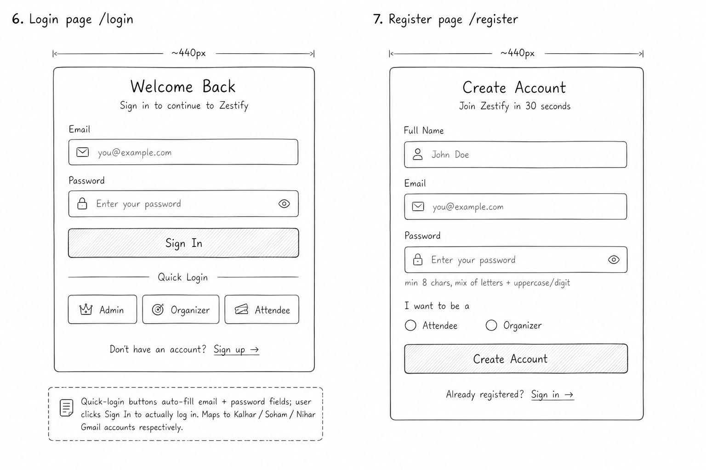

```
                ┌─────────────────────────────────────────────┐
                │                                             │
                │              Welcome Back                   │
                │   Sign in to continue to Zestify            │
                │                                             │
                │   Email                                     │
                │   [ kalharpatel10@gmail.com         ]       │
                │                                             │
                │   Password                                  │
                │   [ •••••••••                       ]       │
                │                                             │
                │   ┌─────────────────────────────────────┐   │
                │   │           Sign In                   │   │
                │   └─────────────────────────────────────┘   │
                │                                             │
                │   ────────── Quick Login ──────────         │
                │   [👑 Admin] [🎯 Organizer] [🎫 Attendee]   │
                │                                             │
                │   Don't have an account? Sign up →          │
                │                                             │
                └─────────────────────────────────────────────┘
```

Quick-login buttons fill the email + password fields (without submitting).
User clicks **Sign In** to commit. Maps to:

| Button | Email | Role |
|--------|-------|------|
| 👑 Admin | kalharpatel10@gmail.com | admin (Kalhar Patel) |
| 🎯 Organizer | sohamrajjain0007@gmail.com | organizer (Soham Raj Jain) |
| 🎫 Attendee | nihardharmeshkumar.patel@sjsu.edu | attendee (Nihar Patel) |

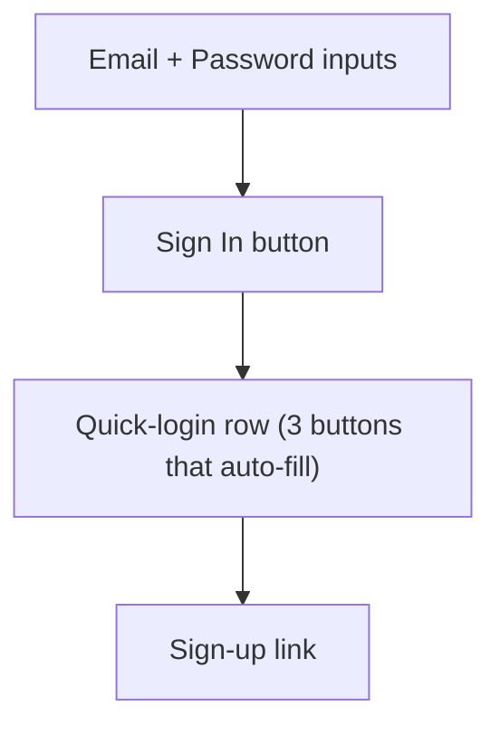
```mermaid
flowchart TB
    F["Email + Password inputs"]
    B["Sign In button"]
    Q["Quick-login row (3 buttons that auto-fill)"]
    L["Sign-up link"]
    F --> B --> Q --> L
```

---

## 7. Register Page  `/register`

```
                ┌─────────────────────────────────────────────┐
                │              Create Account                 │
                │                                             │
                │   Full Name                                 │
                │   [                                  ]      │
                │   Email                                     │
                │   [                                  ]      │
                │   Password (min 8 chars, mix)               │
                │   [                                  ]      │
                │   I want to be a                            │
                │   ( ) Attendee   (•) Organizer              │
                │                                             │
                │   ┌─────────────────────────────────────┐   │
                │   │           Create Account            │   │
                │   └─────────────────────────────────────┘   │
                │   Already registered? Sign in →             │
                └─────────────────────────────────────────────┘
```

---

## 8. Attendee Dashboard — My Tickets  `/dashboard/my-tickets`

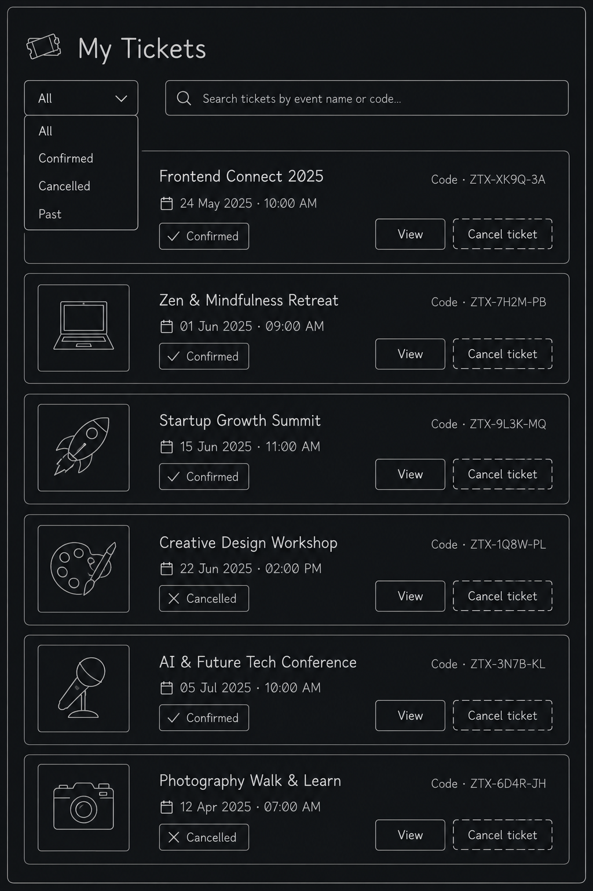

```
┌─────────────────────────────────────────────────────────────────────────┐
│  Navbar                                                                 │
├─────────────────────────────────────────────────────────────────────────┤
│  🎫 My Tickets                                                          │
├─────────────────────────────────────────────────────────────────────────┤
│  Filter: [All ▾ Confirmed · Cancelled · Past]    Search [          ]   │
├─────────────────────────────────────────────────────────────────────────┤
│  ┌────────────────────────────────────────────────────────────────┐    │
│  │ 💻 Virtual Design Systems Workshop      Code · ZTX-XK9Q-3A     │    │
│  │ 📅 Fri Mar 20, 2026 · 10:00 AM                                 │    │
│  │ ✅ Confirmed                          [ View · Cancel ticket ] │    │
│  └────────────────────────────────────────────────────────────────┘    │
│  ┌────────────────────────────────────────────────────────────────┐    │
│  │ 🧘 Mindful Living Retreat              Code · ZTX-AB12-7M     │    │
│  │ 📅 Sat Mar 28, 2026 · 8:00 AM · Napa                          │    │
│  │ ✅ Confirmed                          [ View · Cancel ticket ] │    │
│  └────────────────────────────────────────────────────────────────┘    │
│  ...                                                                    │
└─────────────────────────────────────────────────────────────────────────┘
```

---

## 9. Organizer Dashboard — My Events  `/dashboard/my-events`

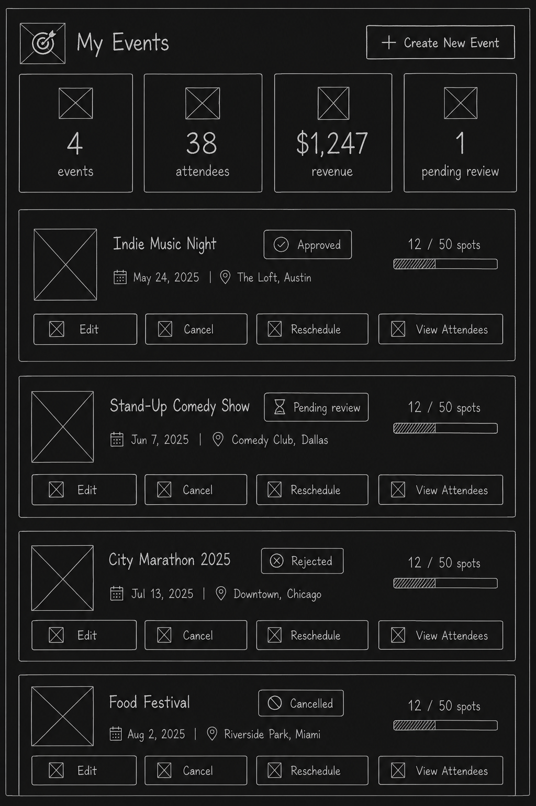

```
┌─────────────────────────────────────────────────────────────────────────┐
│  🎯 My Events                                  [ + Create New Event ]   │
├─────────────────────────────────────────────────────────────────────────┤
│  Stats:  4 events · 38 attendees · $1,247 revenue · 1 pending review    │
├─────────────────────────────────────────────────────────────────────────┤
│  ┌──────────────────────────────────────────────────────────────────┐  │
│  │ 🧘 Mindful Living Retreat       ✅ Approved      12 / 50 spots   │  │
│  │ Mar 28, 2026 · 8:00 AM · Napa                                    │  │
│  │ [Edit] [Cancel] [Reschedule] [View Attendees (12)]               │  │
│  └──────────────────────────────────────────────────────────────────┘  │
│  ┌──────────────────────────────────────────────────────────────────┐  │
│  │ 🎵 Jazz Night                   ⏳ Pending review                 │  │
│  │ ... [View Status]                                                │  │
│  └──────────────────────────────────────────────────────────────────┘  │
└─────────────────────────────────────────────────────────────────────────┘
```

---

## 10. Organizer Attendees Page  `/dashboard/attendees/[id]`

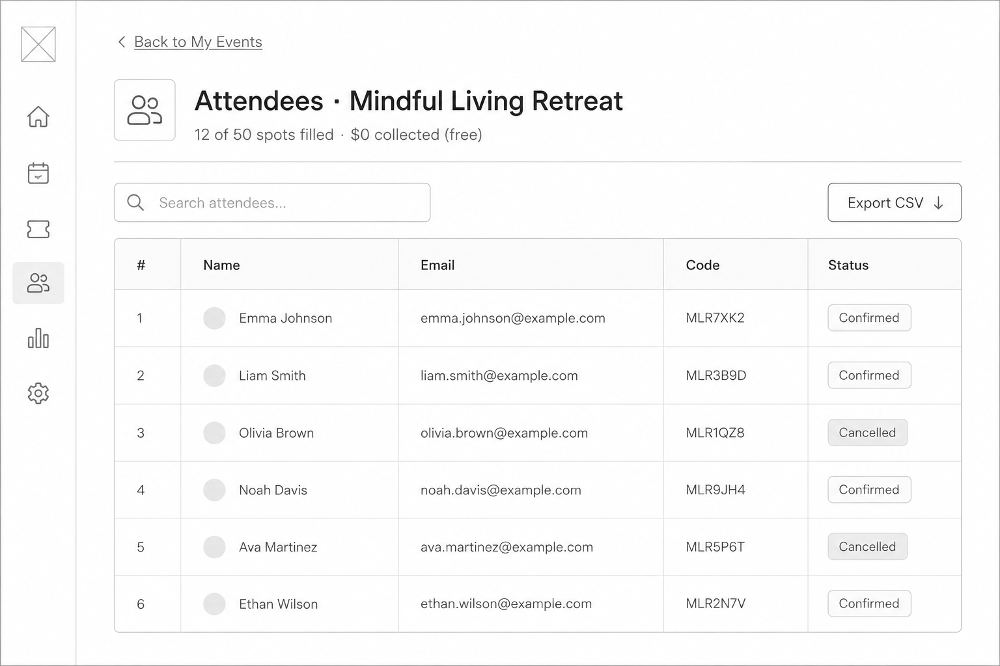

```
┌─────────────────────────────────────────────────────────────────────────┐
│  ‹ Back to My Events                                                    │
│  👥 Attendees · Mindful Living Retreat                                  │
│  12 of 50 spots filled · $0 collected (free)                            │
├─────────────────────────────────────────────────────────────────────────┤
│  Search [             ]    Export CSV ↓                                 │
├─────────────────────────────────────────────────────────────────────────┤
│  #  Name              Email                  Code         Status        │
│  1  Alex Thompson     alex@…                 ZTX-K3F1-9A  Confirmed     │
│  2  Lisa Chen         lisa@…                 ZTX-XM8L-2P  Confirmed     │
│  3  Chris Park        chris@…                ZTX-WP5N-7B  Cancelled     │
│  ...                                                                    │
└─────────────────────────────────────────────────────────────────────────┘
```

---

## 11. Admin Dashboard  `/admin`

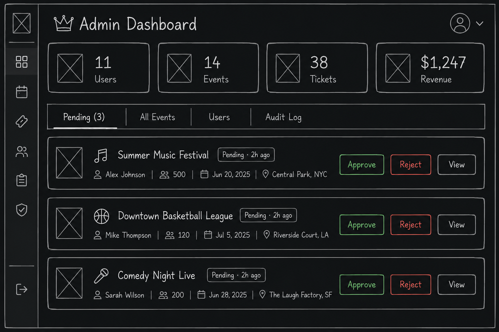

```
┌─────────────────────────────────────────────────────────────────────────┐
│  👑 Admin Dashboard                                                     │
├─────────────────────────────────────────────────────────────────────────┤
│  ┌─────────┬─────────┬─────────┬─────────┐                              │
│  │ 11      │ 14      │ 38      │ $1,247  │   ← Stat cards               │
│  │ Users   │ Events  │ Tickets │ Revenue │                              │
│  └─────────┴─────────┴─────────┴─────────┘                              │
├─────────────────────────────────────────────────────────────────────────┤
│  Tabs:  [ Pending (3) ]  [ All Events ]  [ Users ]  [ Audit Log ]      │
├─────────────────────────────────────────────────────────────────────────┤
│  ┌───────────────────────────────────────────────────────────────────┐ │
│  │ 🎵 Underground Jazz Night                       Pending · 2h ago  │ │
│  │ by Sarah Chen · Capacity 80 · Mar 28 · Oakland                    │ │
│  │ [ Approve ]  [ Reject ]  [ View ]                                 │ │
│  └───────────────────────────────────────────────────────────────────┘ │
│  ┌───────────────────────────────────────────────────────────────────┐ │
│  │ ... more pending events ...                                       │ │
│  └───────────────────────────────────────────────────────────────────┘ │
└─────────────────────────────────────────────────────────────────────────┘
```

---

## 12. Notifications Page  `/notifications`

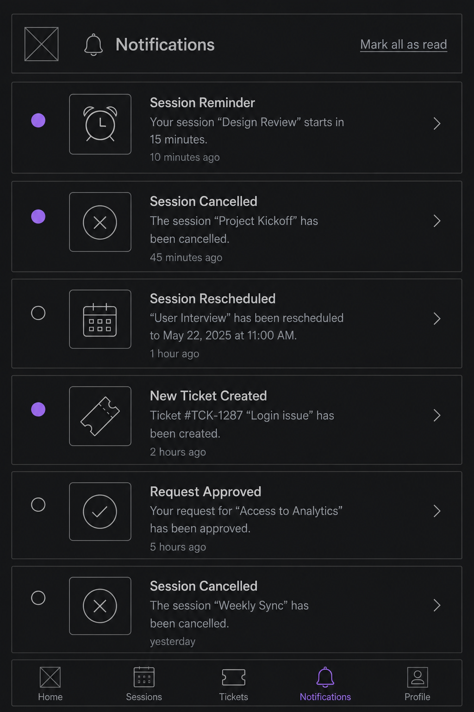

```
┌─────────────────────────────────────────────────────────────────────────┐
│  🔔 Notifications                                    Mark all as read   │
├─────────────────────────────────────────────────────────────────────────┤
│  ● ⏰ Event Starting Soon                                  10 minutes  │
│    "Mindful Living Retreat" starts in ~12 hours.                       │
│  ● ❌ Event Cancelled                                       1 hour      │
│    "Beach Cleanup" scheduled for Apr 12 has been cancelled.            │
│  ● 📅 Event Rescheduled                                     yesterday   │
│    "Code Conf" moved from Apr 10 → Apr 18.                             │
│  ○ 🎫 Ticket Confirmed                                      2 days ago  │
│    Your ticket for "Mindful Living Retreat" is confirmed.              │
│  ...                                                                    │
└─────────────────────────────────────────────────────────────────────────┘

  ● = unread     ○ = read
```

---

## 13. Event Creation Page  `/events/create`

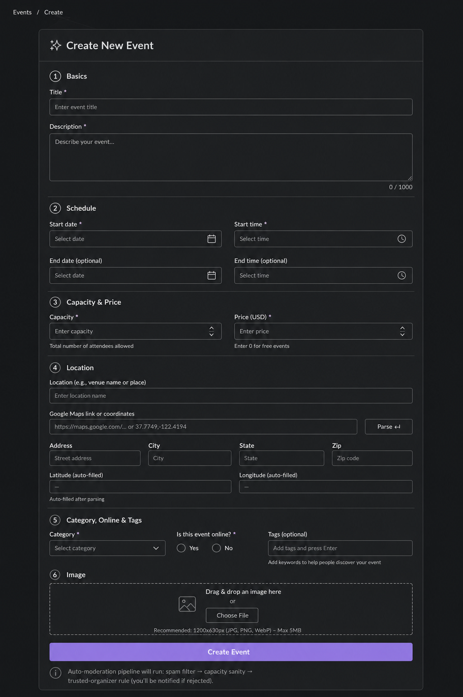

```
┌─────────────────────────────────────────────────────────────────────────┐
│  ✨ Create New Event                                                    │
├─────────────────────────────────────────────────────────────────────────┤
│  Title              [                                          ]        │
│  Description        [                                          ]        │
│                     [                                          ]        │
│  Date / Time        [ 2026-05-15 ]  [ 18:00 ]                          │
│  End date / time    [             ]  [       ]   (optional)            │
│  Capacity           [ 100        ]   Price [ 0 ] USD                   │
│                                                                         │
│  Location           [ San Jose State University                ]        │
│  Google Maps link   [ paste link or coords        ]   [ Parse ↩︎ ]      │
│  Address / City     [               ] [           ]                     │
│  Lat / Lon          [ 37.3352 ] [ -121.8811 ]   ← auto-filled from link │
│                                                                         │
│  Category           [ Technology ▾ ]                                    │
│  Is online?         ( ) Yes  (•) No                                     │
│  Tags               [ design, ui, frontend ]                            │
│                                                                         │
│  ┌─────────────────────────────────────────────────────────────────┐    │
│  │                       Create Event                              │    │
│  └─────────────────────────────────────────────────────────────────┘    │
│  Auto-moderation pipeline will run: spam filter → capacity sanity →     │
│  trusted-organizer rule (you'll be notified if rejected).               │
└─────────────────────────────────────────────────────────────────────────┘
```

---

## 14. Email Template Wireframes

All emails inherit the same structure — the `EmailAdapter.locationBlock()` is
re-used across types so the **Google Maps link** is in every event email.

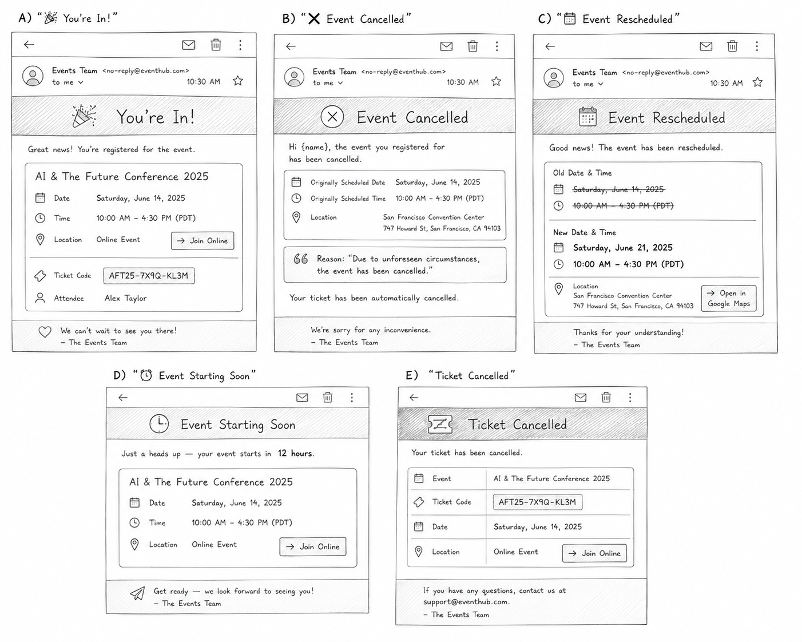

### 14a. Ticket Confirmation

```
┌──────────────────────────────────────────────────────┐
│   🎉 You're In!                                       │ ← violet→cyan gradient
│   Your ticket has been confirmed                     │
├──────────────────────────────────────────────────────┤
│   ## Virtual Design Systems Workshop                 │
│   📅 Mar 20, 2026 at 10:00 AM                        │
│   💻 Online Event                                    │
│   [ → Join Online ]   ← cyan button                  │
│   🎫 Code: ZTX-K3F1-9A                                │
│   👤 Nihar Patel                                     │
│   ─────────────────────────────────────              │
│   Thank you for registering through Zestify!         │
└──────────────────────────────────────────────────────┘
```

### 14b. Event Cancelled

```
┌──────────────────────────────────────────────────────┐
│   ❌ Event Cancelled                                  │ ← red header
├──────────────────────────────────────────────────────┤
│   ## Mindful Living Retreat                          │
│   Hi Nihar,                                          │
│   The event you registered for has been cancelled.   │
│   Originally scheduled: 📅 Mar 28 at 8:00 AM         │
│   📍 1234 Main St, Napa, CA, 94559                   │
│   [ → Open in Google Maps ]                          │
│   Reason: Venue closed due to weather                │
│   Your ticket has been automatically cancelled.      │
└──────────────────────────────────────────────────────┘
```

### 14c. Event Rescheduled

```
┌──────────────────────────────────────────────────────┐
│   📅 Event Rescheduled                                │ ← amber→violet header
├──────────────────────────────────────────────────────┤
│   ## Mindful Living Retreat                          │
│   Hi Nihar,                                          │
│   The event has been rescheduled.                    │
│   Old:  Mar 28 at 8:00 AM   (struck through)         │
│   New:  Mar 30 at 9:00 AM   ← bold                   │
│   📍 1234 Main St, Napa, CA                          │
│   [ → Open in Google Maps ]                          │
│   Your ticket remains valid.                         │
└──────────────────────────────────────────────────────┘
```

### 14d. 12h Reminder

```
┌──────────────────────────────────────────────────────┐
│   ⏰ Event Starting Soon                              │ ← cyan→violet header
├──────────────────────────────────────────────────────┤
│   ## Virtual Design Workshop                         │
│   Hi Nihar, your event starts in **12 hours**.       │
│   📅 Mar 20 · 10:00 AM                               │
│   📍 Online Event                                    │
│   [ → Join Online ]                                  │
│   See you there!                                     │
└──────────────────────────────────────────────────────┘
```

### 14e. Ticket Cancelled (user-initiated)

```
┌──────────────────────────────────────────────────────┐
│   Ticket Cancelled                                   │ ← slate header
├──────────────────────────────────────────────────────┤
│   ## Event Title                                     │
│   Hi Nihar,                                          │
│   Your ticket (code ZTX-K3F1-9A) has been cancelled. │
│   📅 Mar 20 · 10:00 AM                               │
│   [ → Open in Google Maps ]                          │
└──────────────────────────────────────────────────────┘
```

---

## 15. Site Map

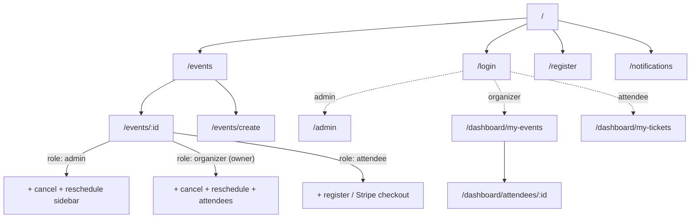
```mermaid
flowchart TB
    HOME["/"] --> EV["/events"]
    HOME --> LOG["/login"]
    HOME --> REG["/register"]
    EV --> EVD["/events/:id"]
    EV --> EVC["/events/create"]
    LOG -.->|admin| ADMIN["/admin"]
    LOG -.->|organizer| MYE["/dashboard/my-events"]
    LOG -.->|attendee| MYT["/dashboard/my-tickets"]
    MYE --> ATT["/dashboard/attendees/:id"]
    HOME --> NOT["/notifications"]
    EVD -->|"role: admin"| EVD_ADMIN["+ cancel + reschedule sidebar"]
    EVD -->|"role: organizer (owner)"| EVD_ORG["+ cancel + reschedule + attendees"]
    EVD -->|"role: attendee"| EVD_USER["+ register / Stripe checkout"]
```

---

## 16. Color & Token Reference (design system)

| Token | Value | Usage |
|-------|-------|-------|
| `--violet` | `#7c3aed` | Primary buttons, links, active states |
| `--cyan` | `#06b6d4` | Accent, "Open in Google Maps" buttons |
| `--gradient-card` | violet→cyan | Hero banner, event card backgrounds |
| `--red` | `#ef4444` | Cancel buttons, error toasts, cancelled badges |
| `--amber` | `#f59e0b` | Reschedule actions, warning |
| `--slate` | `#64748b` | Muted text, ticket-cancelled emails |
| `--surface` | `#0a0a14` → `#f8fafc` | Dark-mode bg → light card bg |
| `--text-muted` | `#94a3b8` | Captions, helper text |
| Font | system + Inter fallback | All UI |

All UI tokens live in `frontend/src/app/globals.css` as CSS custom properties so
the whole site can be re-themed in one place.
